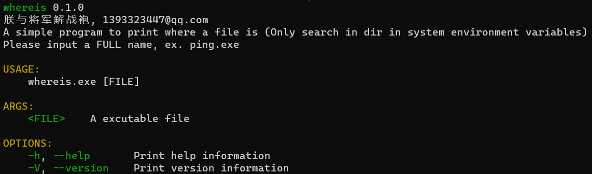

# 简介
这个仓库包含一些用 `Rust` 实现的命令行工具。

# wcat

和 `linux` 上的 `cat` 差不多

## 简单演示

# dump

## 简单演示

# grep

和 `linux` 上的 `grep` 差不多，支持递归匹配目录中的文件，支持多线程匹配。

## 简单演示

# ping

用 `Rust` 重写的 `ping` 命令。

## 简单演示

# whereis
用于在系统环境变量目录中搜索指定文件, 并打印匹配结果。

## 简单演示

